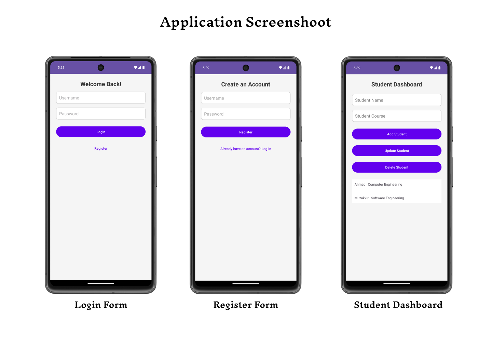

# Simple Student Manage Apps

This is a simple Android application for managing student records. Users can add, update, and delete student information such as names and courses. The app features a clean and user-friendly.

## Features

- Add new students with their names and courses.
- Update existing student records.
- Delete student records.
- View a list of all students with their respective courses.

## Screenshots


## Technologies Used

- **Programming Language**: Java
- **Database**: SQLite
- **Android SDK**: API level 35 (replace with your target SDK version)

## Getting Started

### Prerequisites

- Android Studio installed on your machine.
- An Android device or emulator.

### Installation

1. Clone the repository:
   ```bash
   git clone https://github.com/mhdthariq/SQLite.git
   ```
2. Open the project in Android Studio.
3. Wait for the project to sync and build.
4. Run the app on your Android device or emulator.

### Usage

1. Launch the app.
2. Register first to make account for login.
3. Login to the application.
4. To add a new student, enter the name and course, then click the "Add Student" button.
5. To update a student, select a student from the list, modify the details, and click the "Update Student" button.
6. To delete a student, select a student from the list and click the "Delete Student" button.


## Acknowledgements

- SQLite for providing a lightweight database solution.
